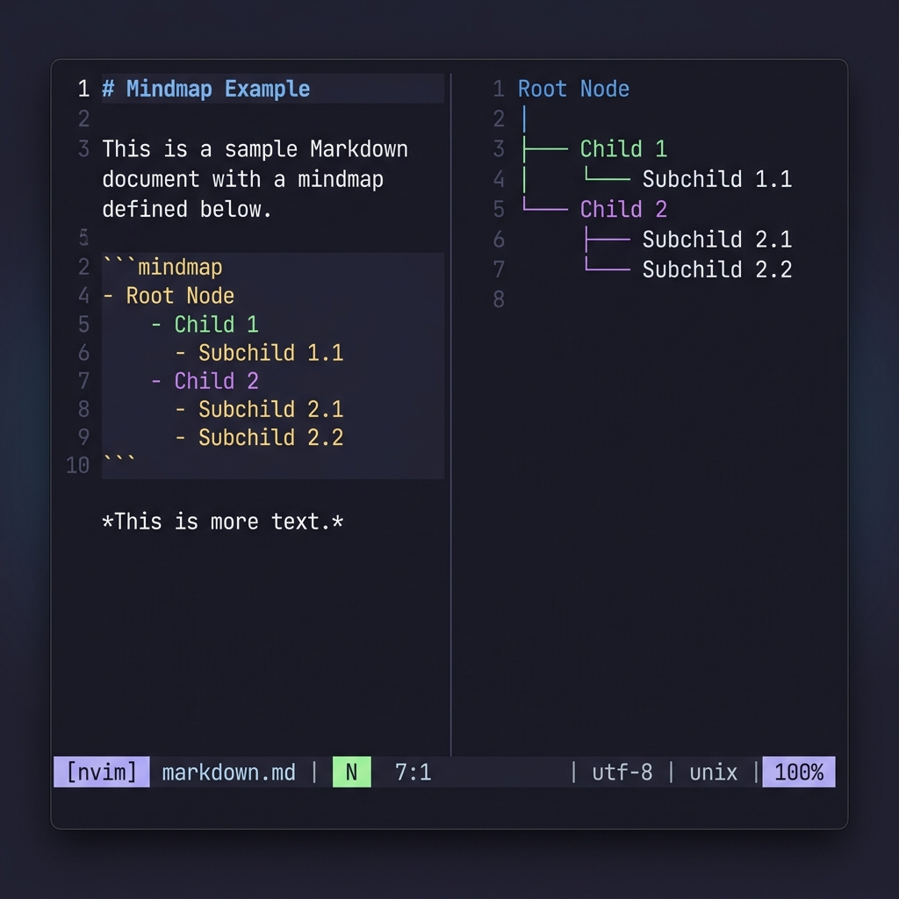

# mindmap.nvim

A lightweight, terminal-native, spatial mindmapping plugin for Neovim written in 100% Lua. It converts hierarchical text outlines (`.mm` files) into a spatial 2D tree diagram inside a read-only scratch buffer with interactive cursor navigation and live editing.

---

## Features

- **Bidirectional Outline <-> Map Toggling**: Press `gm` in any `.mm` outline file to project it as a visual tree. Syncs cursor position perfectly between modes.
- **Vertical, Horizontal, & Split layouts**: Choose between a vertical tree layout (ideal for deep hierarchies), a horizontal left-to-right layout (ideal for wide trees), or a split (bilateral) layout that centers the root and distributes children symmetrically. Toggle dynamically with `gl`.
- **Adaptive Snapped Navigation**: Snapped directional keys (`h`, `j`, `k`, `l`) adapt on-the-fly to your active layout and direction.
- **Single Scratch Buffer Rendering**: High performance, native scroll/pan support, and pixel-perfect connector lines using box-drawing characters.
- **Adaptive Theme Highlights**: Node depths link dynamically to your editor's colorscheme highlight groups (`Title`, `String`, `Identifier`, etc.).
- **Snapped Cursor Navigation**: Cursor automatically snaps to the center of node boxes, locking movement to the tree structure.
- **In-Place Text Editing**: Press `<CR>` or `i` over a node to open a borderless single-line float. Saving auto-updates the layout and outline file.
- **Structural Tree Operations**: Create children/siblings, indent/outdent, and delete nodes/subtrees directly in map mode.

---

## Installation

### Using [lazy.nvim](https://github.com/folke/lazy.nvim)

```lua
{
  "muhfaris/mindmap.nvim",
  config = function()
    require("mindmap").setup({
      -- Default options
      layout = "vertical",   -- "vertical", "horizontal", or "split"
      auto_preview = false,  -- Set to true to auto-preview mindmaps inside markdown files
    })
  end,
}
```

---

## Usage

### 1. The Data File
Create a text file with the `.mm` extension. Write a standard markdown-style list where hierarchy is defined by indentation (spaces or tabs):

```markdown
- Gherkio v2
  - Transform block
    - Array proj
      - dot path
      - wildcard
    - Filters
  - Report UI
    - Try-it
      - CORS fix
    - Token mask
```

### 2. Enter Map Mode
Press `gm` (or run `:MindmapToggle`) inside the `.mm` buffer. The editor will transition into a spatial 2D mindmap.

#### Vertical Layout Result:
```text
                                ┏━━━━━━━━━━━━┓
                                ┃ Gherkio v2 ┃
                                ┗━━━━━━┳━━━━━┛
                        ╭──────────────┴────────────────────╮
               ╭────────┴────────╮                    ╭─────┴─────╮
               │ Transform block │                    │ Report UI │
               ╰────────┬────────╯                    ╰─────┬─────╯
                  ╭─────┴─────────────╮             ╭───────┴──────╮
           ╭──────┴─────╮        ╭────┴────╮   ╭────┴───╮   ╭──────┴─────╮
           │ Array proj │        │ Filters │   │ Try-it │   │ Token mask │
           ╰──────┬─────╯        ╰─────────╯   ╰────┬───╯   ╰────────────╯
           ╭──────┴──────╮                          │
     ╭─────┴────╮  ╭─────┴────╮               ╭─────┴────╮
     │ dot path │  │ wildcard │               │ CORS fix │
     ╰──────────╯  ╰──────────╯               ╰──────────╯
```

#### Horizontal Layout Result:
```text
                                                            ╭──────────╮
                                                         ╭──┤ dot path │
                                                         │  ╰──────────╯
                                          ╭────────────╮ │
                                       ╭──┤ Array proj ├─┤
                   ╭─────────────────╮ │  ╰────────────╯ │  ╭──────────╮
                ╭──┤ Transform block ├─┤                 ╰──┤ wildcard │
                │  ╰─────────────────╯ │                    ╰──────────╯
                │                      │
                │                      │
 ┏━━━━━━━━━━━━┓ │                      │  ╭─────────╮
 ┃ Gherkio v2 ┣─┤                      ╰──┤ Filters │
 ┗━━━━━━━━━━━━┛ │                         ╰─────────╯
                │
                │
                │                   ╭────────╮    ╭──────────╮
                │                ╭──┤ Try-it ├────┤ CORS fix │
                │                │  ╰────────╯    ╰──────────╯
                │  ╭───────────╮ │
                ╰──┤ Report UI ├─┤
                   ╰───────────╯ │  ╭────────────╮
                                 ╰──┤ Token mask │
                                    ╰────────────╯
```

#### Split (Bilateral) Layout Result:
```text
                                                                                                                                                        ╭─────────────╮
                                                                                                                                                     ╭──┤ Core Engine │
                                                                                                                                                     │  ╰─────────────╯
                                                                                                                                                     │
                                                                                                                                                     │
                                                                                                                                    ╭──────────────╮ │  ╭───────────────────╮
                                                                                                                                 ╭──┤ A.1 Features ├─┼──┤ Interactive Input │
 ╭───────────────────╮                                                                                                           │  ╰──────────────╯ │  ╰───────────────────╯
 │ State Persistence ├──╮                                                                                                        │                   │
 ╰───────────────────╯  │                                                                                                        │                   │
                        │ ╭─────────────╮    ╭────────────────╮                                              ╭─────────────────╮ │                   │  ╭─────────╮
                        ├─┤ C.1 Folding ├────┤ Left Subtree C ├──╮                                        ╭──┤ Right Subtree A ├─┤                   ╰──┤ Keymaps │
     ╭───────────────╮  │ ╰─────────────╯    ╰────────────────╯  │                                        │  ╰─────────────────╯ │                      ╰─────────╯
     │ Node Collapse ├──╯                                        │                                        │                      │
     ╰───────────────╯                                           │                                        │                      │
                                                                 │ ┏━━━━━━━━━━━━━━━━━━━━━━━━━━━━━━━━━━━━┓ │                      │                     ╭──────────╮
                                                                 ├─┫ Mindmap Split Layout Demonstration ┣─┤                      │                  ╭──┤ Vertical │
   ╭─────────────────╮                                           │ ┗━━━━━━━━━━━━━━━━━━━━━━━━━━━━━━━━━━━━┛ │                      │                  │  ╰──────────╯
   │ Headless Runner ├──╮                                        │                                        │                      │  ╭─────────────╮ │
   ╰─────────────────╯  │                                        │                                        │                      ╰──┤ A.2 Layouts ├─┤
                        │ ╭─────────────╮    ╭────────────────╮  │                                        │                         ╰─────────────╯ │  ╭────────────╮
                        ├─┤ D.1 Testing ├────┤ Left Subtree D ├──╯                                        │                                         ╰──┤ Horizontal │
   ╭─────────────────╮  │ ╰─────────────╯    ╰────────────────╯                                           │                                            ╰────────────╯
   │ Assertion Suite ├──╯                                                                                 │
   ╰─────────────────╯                                                                                    │
                                                                                                          │                                            ╭───────────────────╮
                                                                                                          │                                         ╭──┤ Theme Integration │
                                                                                                          │                                         │  ╰───────────────────╯
                                                                                                          │  ╭─────────────────╮    ╭─────────────╮ │
                                                                                                          ╰──┤ Right Subtree B ├────┤ B.1 Styling ├─┤
                                                                                                             ╰─────────────────╯    ╰─────────────╯ │  ╭─────────────────╮
                                                                                                                                                    ╰──┤ Highlight Links │
                                                                                                                                                       ╰─────────────────╯
```

### 3. Controls

#### Outline Mode

| Key | Description |
| :--- | :--- |
| `gm` | Switch to Map Mode (renders outline as 2D diagram) |
| `gl` | Toggle default layout mode dynamically (Vertical -> Horizontal -> Split) |
| `?` | Show floating help popup listing all controls |

#### Map Mode

| Key | Description |
| :--- | :--- |
| `gm` | Switch back to Outline Mode (returns cursor to the correct line) |
| `gl` | Toggle layout mode dynamically (Vertical -> Horizontal -> Split) |
| `gy` | Yank the full rendered mindmap to the system clipboard |
| `h` | Move left (parent or child depending on layout/direction) |
| `l` | Move right (child or parent depending on layout/direction) |
| `k` | Move up (sibling or parent depending on layout/direction) |
| `j` | Move down (sibling or child depending on layout/direction) |
| `i` / `a` / `cc` / `<CR>` | Edit selected node text (opens floating input window) |
| `o` | Add child node |
| `O` | Add sibling node |
| `dd` | Delete selected node and its subtree |
| `<Tab>` | Indent (make child of previous sibling) |
| `<S-Tab>` | Outdent (make sibling of parent) |
| `<Space>` / `za` | Toggle collapse/expand on selected node |
| `?` | Show floating help popup listing all controls |

### 4. Markdown Support & Auto-Preview

You can use `mindmap.nvim` to render and edit mindmaps directly embedded inside standard Markdown (`.md`) files using ` ```mindmap ` fenced code blocks:

```markdown
# My Project Article
Here is some introductory paragraph text.

```mindmap
- Root Node
  - Child 1
    - Child 1
  - Child 2
    - Child 1
    - Child 1
```

Other text in the document remains intact.
```

- **Manual Toggle**: Press `gm` inside the ` ```mindmap ` code block to toggle the visual mindmap editor. Any edits made in map mode will target and sync back ONLY to that specific fenced block, keeping the rest of your Markdown file untouched.
- **Auto-Preview Mode**: With `auto_preview = true` enabled in the plugin setup, a vertical split window will automatically open showing the rendered mindmap preview when your cursor enters the fenced code block, update dynamically as you move the cursor or edit, and close automatically when your cursor leaves the block.



---

## Customization

You can customize the default layout globally via a global variable or setup configuration:

```lua
-- Set default layout to horizontal globally
vim.g.mindmap_layout = "horizontal"
```

The plugin creates default highlight groups that link directly to standard Neovim highlight groups. You can customize them in your colorscheme or init configuration:

```lua
-- Examples:
vim.api.nvim_set_hl(0, "MindmapDepth0", { fg = "#ff007f", bold = true }) -- Root node
vim.api.nvim_set_hl(0, "MindmapDepth1", { fg = "#00f0ff" })             -- Depth 1 nodes
vim.api.nvim_set_hl(0, "MindmapSelected", { bg = "#2e3440" })           -- Cursor snapped node
vim.api.nvim_set_hl(0, "MindmapConnector", { fg = "#4c566a" })          -- Right-angle line connections
```

Default linkages:
- `MindmapDepth0` -> `Title`
- `MindmapDepth1` -> `String`
- `MindmapDepth2` -> `Identifier`
- `MindmapDepth3` -> `Constant`
- `MindmapDepth4` -> `Special`
- `MindmapSelected` -> `CursorLine`
- `MindmapConnector` -> `Comment`
